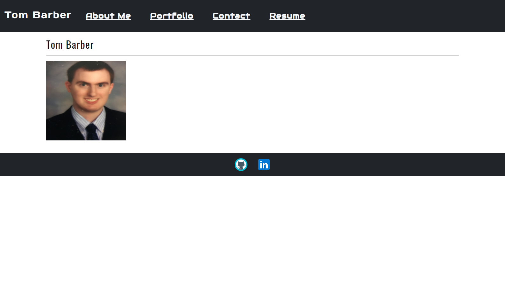
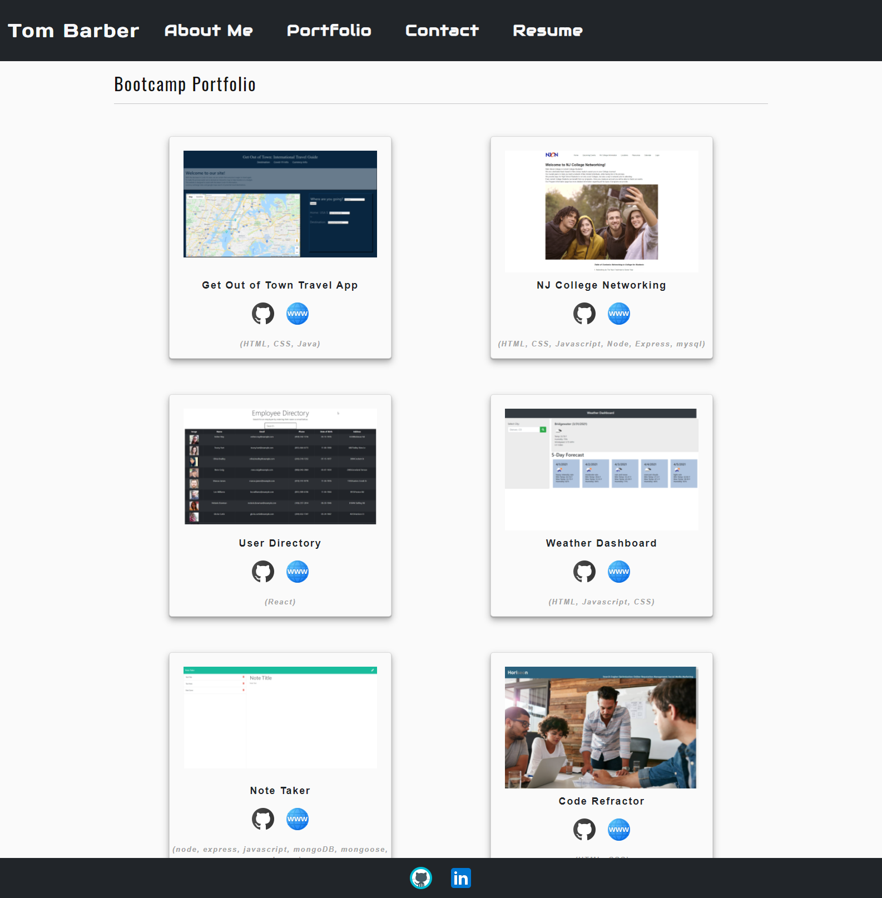

  ## Title
  React Portfolio
  ## Description 
  Every prospective web design employee needs a well-designed portfolio to show off their skills to prospective employers.  This is a personal portfolio made with React.
  
  ## Table of Contents
  1. [Installation](#installation)
  2. [Usage](#usage)
  3. [License](#license)
  4. [Contributing](#contributing)
  5. [Tests](#tests)
  6. [Contact](#contact)
  
  ## Installation
  Only one step needed, run "npm install" in the project's command line.
  ## Usage
  The command "npm start" runs the project
  ## License
  MIT License
  ## Contributing
  Contact me at trb5160@gmail.com
  ## Tests
  No tests for this project
  
  
  ## Links
  Github: https://github.com/trb5160/tb_reactportfolio
  Website Link:https://trb5160.github.io/tb_reactportfolio/ 
